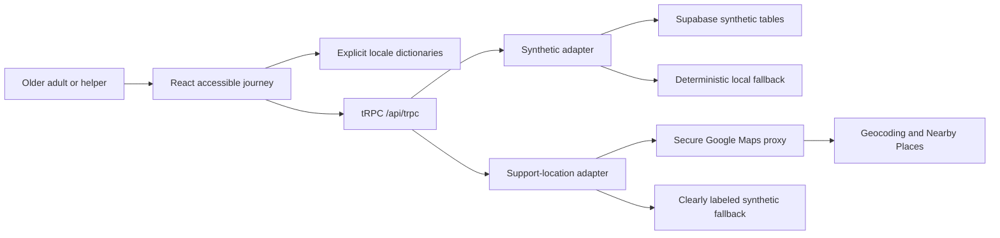

# Sahara Pramaan — Judge Submission Brief

**Release:** Final hackathon-ready service concept · 27 August 2026  
**Public app:** [sahara-pramaan.vercel.app](https://sahara-pramaan.vercel.app)  
**Repository:** [github.com/apranav1711-byte/sahara-pramaan](https://github.com/apranav1711-byte/sahara-pramaan)

## One-line proposition

> **When one digital path fails, Sahara Pramaan keeps the person moving.**

Sahara Pramaan is an India-focused, accessible certificate-support service concept for older adults, families, volunteers, and assisted-service operators. It turns a stressful annual digital step into a calm, multilingual, recoverable journey: explain the status plainly, guide the user through verification, offer human assistance when a biometric path fails, and help the person reach a nearby support option.

## The problem

Many older adults do not experience a digital public-service task as a single form. They experience a chain of uncertainty: unfamiliar language, small controls, a failed fingerprint attempt, an unavailable camera, a weak network, or the need for a family member to help without taking over. A product that only optimizes the happy path leaves the person stranded at the exact moment trust matters most.

Sahara Pramaan focuses on that recovery moment. The experience is intentionally designed around large touch targets, plain-language status, browser-native read-aloud, visible stop-reading control, high contrast, large type, reduced motion, explicit back actions, offline/session fallback messaging, and a family-assist route that is clearly described as assistance rather than identity verification.

## India-first design decisions

| Design decision | What the product does | Why it matters |
| --- | --- | --- |
| Language choice | Renders critical shell, onboarding, login, status, accessibility, and locator copy in English, Hindi, Bengali, Marathi, Telugu, Tamil, Gujarati, Kannada, Malayalam, and Punjabi. | A language preference must change the experience, not merely be stored. |
| PIN discovery | Accepts a six-digit Indian PIN and treats it as a broad postal area. | A PIN is useful for area-level discovery but must not be presented as an exact home location. |
| Consent-aware location | Offers optional browser geolocation; coordinates remain in client memory for the current session. | Users can choose whether to share a more relevant nearby signal. |
| Support discovery | Uses a server-side Google Maps proxy for transient geocoding and nearby Places search when available. | The locator can be provider-ready without exposing map credentials in the browser. |
| Degraded behavior | Clearly labels synthetic illustrative locations when the Maps provider, quota, credentials, or browser map script is unavailable. | The demo remains usable without pretending that fallback records are live. |
| Human recovery | Offers liveness, family assistance, and support-location alternatives after a simulated fingerprint failure. | Recovery is treated as a first-class service outcome rather than an error page. |

## What the judge can experience

The fastest reliable recording route uses the synthetic `DEMO-FAIL` account with mock OTP `123456`. It intentionally reaches the fallback path so the product’s central idea is visible within one demonstration.

| Step | Action | What to point out |
| --- | --- | --- |
| 1 | Open the public app and open the comfort menu. | Language, theme, large type, high contrast, guided mode, read-aloud, stop-reading, disclosure, and reset are immediately reachable. |
| 2 | Select Kannada, Hindi, Bengali, or another supported language. | The selected locale changes the critical landing and login experience, not only the selector label. |
| 3 | Choose **Begin securely** and sign in with `DEMO-FAIL` / `123456`. | The account is explicitly synthetic; no real pension or identity system is contacted. |
| 4 | Start verification. | The simulated fingerprint attempt intentionally fails for the recording account. |
| 5 | Show the fallback options. | Liveness, family assistance, and nearby support discovery keep the user moving. |
| 6 | Open the locator with PIN `110001` or consent to temporary device location. | Live Google results appear only when the provider path works; otherwise the synthetic fallback is labeled. A PIN is not an exact address. |
| 7 | Optionally demonstrate family assistance in a second window. | The family flow has a 24-hour expiry, five-attempt limit, polling, and explicit non-impersonation language. |
| 8 | Demonstrate the confirmation, theme, read-aloud stop, or back action. | The product is designed for recovery, comfort, and controlled completion rather than a single fragile biometric path. |

All credentials in this document are synthetic recording aids. The application must not be represented as an official certificate service, a government database, a pension-status checker, a biometric matcher, or a live messaging service.

## Feature and implementation status

| Capability | Status in this release | Evidence or boundary |
| --- | --- | --- |
| Accessible product shell | Complete | Responsive layout, semantic regions, visible focus, large type, high contrast, reduced motion, light/dark theme. |
| Multilingual critical journey | Implemented | Ten explicit locale dictionaries with React rendering and locale-aware speech language. Native-speaker review remains a recommended next step. |
| Synthetic login and status | Complete for demo | Deterministic `DEMO-FAIL`, `DEMO-PASS`, and `DEMO-MIXED` paths with mock OTP. |
| Fingerprint and liveness | Synthetic simulation | No biometric image is captured, stored, or matched. Camera permission is preview-only. |
| Family assistance | Complete for demo | Public synthetic link, two-window state refresh, 24-hour expiry, bounded attempts, and non-impersonation disclosure. |
| Support locator | Provider-ready with fallback | `prototype.liveLocations` validates PIN/coordinates, calls the server-side Maps adapter, maps nearby Places, and falls back to synthetic locations. |
| Real Google Places response | Environment-dependent | The latest public smoke test returned `source: "synthetic"`; no live provider data is claimed for that run. |
| Reminders | Synthetic only | Preference persistence is demonstrated; no SMS, voice call, WhatsApp message, or family alert is sent. |
| Real authentication | Deferred | Google OAuth requires a configured client and server-side token validation. |
| WhatsApp OTP | Deferred | Requires Meta Business setup, verified sender, approved templates, opt-in, secure credentials, and delivery controls. |
| Government or pension integration | Not connected | Requires formal partnerships, security review, data protection, audit, and operational authorization. |

## Architecture

The browser presents the accessible journey and calls typed tRPC procedures. Synthetic pension state and reminders use the existing Supabase-compatible adapter with a deterministic local fallback. The location path is deliberately separate: the app server calls the authenticated Maps proxy, returns a normalized transient response, and never places a provider secret in the client or database.



The deployed Vercel build includes the Vite client and the committed `api/[...path].js` catch-all tRPC bundle. The service worker is network-first for the application shell and never caches `/api/` responses.

## Data, privacy, and trust boundary

> **Independent service concept — synthetic data only.** Sahara Pramaan is not affiliated with the Government of India, UIDAI, India Post, any bank, or any pension authority.

The demo uses synthetic pensioner records, mock OTPs, simulated verification outcomes, fake confirmation references, synthetic reminder preferences, and synthetic family-assist answers. Device coordinates are used only temporarily for the current locator request and are not persisted. Live Places results, if returned by the configured proxy, are displayed transiently and are not written to the synthetic database.

The family-assist flow is intentionally public for recording convenience and is not a production identity-assurance mechanism. A real deployment would require signed expiring links, audited authorization, consent, rate limiting, abuse monitoring, secure identity assurance, data minimization, and operational escalation.

## Reproducible verification

The final repository state is `63e8637` on `main`. The matching Vercel production deployment is `dpl_5BsbWR3xSP8zSf7baTnXqMdxntsu`, marked **READY**.

| Command | Purpose | Result |
| --- | --- | --- |
| `pnpm check` | TypeScript validation | Passed |
| `pnpm test` | Unit and contract tests | Passed — 7 files, 16 tests |
| `pnpm build:vercel` | Client and Vercel tRPC bundle | Passed; only a non-blocking chunk-size warning |
| `pnpm test:production` | Public manifest, service worker, login, camps, support locations, family link, reminders, and reset | Passed; support response was honestly labeled synthetic |

To run locally:

```bash
pnpm install
pnpm dev
```

For another deployment:

```bash
SMOKE_BASE_URL=https://your-deployment.vercel.app pnpm test:production
```

## What is intentionally not claimed

Sahara Pramaan does not claim to issue an official life certificate, verify a real pensioner, match a fingerprint, validate a government record, send a WhatsApp OTP, send an SMS or voice call, identify an exact home from a PIN, or provide a production-secure family authorization method. These are not hidden limitations; they are visible product disclosures and part of the judging narrative.

A six-digit PIN identifies a broad postal area and cannot identify an exact household location. India Post describes DIGIPIN as a separate and more precise location identifier that requires a device location capability; any future use would require a separate privacy and technical review.[3]

## Recommended next release

The highest-impact next feature is a consented **assisted operator mode** for volunteers, post-office helpers, or community service operators. It should support a session handoff, clear user consent, large step cards, a visible end-of-session receipt, and no transfer of account ownership. The next layer should be a verified and timestamped directory of CSCs, post offices, bank correspondents, and assisted-service centers.

The product should then add a human escalation flow, native-speaker language QA, an accessibility evidence scorecard, a privacy and consent center, safe-handoff receipts, and anonymized operator insights. Real Google login and WhatsApp OTP should be enabled only after the required provider setup and compliance review are complete.[1] [2]

## Documentation map

| Document | Use it for |
| --- | --- |
| [`README.md`](../README.md) | Public overview, setup, demo accounts, data boundary, and architecture summary. |
| [`docs/productization-handoff.md`](./productization-handoff.md) | Operational handoff, repository map, release process, and acceptance checklist. |
| [`docs/india-hackathon-roadmap.md`](./india-hackathon-roadmap.md) | India-specific product strategy and next-feature priorities. |
| [`docs/integration-status.md`](./integration-status.md) | Current Supabase, Google Maps proxy, GitHub, and Vercel integration state. |
| [`docs/recording-runbook.md`](./recording-runbook.md) | Repeatable two-minute recording and QA sequence. |
| [`docs/production-qa-session-2026-08-26.md`](./production-qa-session-2026-08-26.md) | Timestamped production evidence, with historical checkpoints clearly separated from the final release. |
| [`docs/qa-360px.md`](./qa-360px.md) | Mobile-width responsive QA snapshot. |
| [`supabase/functions/README.md`](../supabase/functions/README.md) | Synthetic Supabase function operations and safety boundaries. |

## References

[1]: https://developers.google.com/identity/sign-in/web/sign-in "Google Identity Services web documentation"
[2]: https://developers.facebook.com/documentation/business-messaging/whatsapp/templates/authentication-templates/authentication-templates "Meta WhatsApp authentication templates"
[3]: https://www.indiapost.gov.in/digipin "India Post DIGIPIN"
